# FortiGate and GWLB in AWS

## Table of Contents
  - [Overview](./README.md#overview)
  - [Solution Components](./README.md#solution-components)
  - [Use Cases](./README.md#use-cases)
  - [Failover Process](./README.md#failover-process)
  - [CloudFormation Templates](./README.md#cloudformation-templates)
  - [Deployment](./README.md#deployment)
  - [FAQ \ Tshoot](./README.md#faq--troubleshoot)

## Overview
FortiOS supports integrating with AWS Gateway Load Balancer (GWLB) starting in version 6.4.4 GA and newer versions.  GWLB makes it easier to inspect traffic with a fleet of acitve-active FortiGates.  GWLB track flows and sends traffic for a single flow to the same FortiGate so there is no need to apply source NAT to have symetrical routing.  Also with the use of VPC Ingress Routing and GWLB endpoints (GWLBe), you can easily use VPC routes to granularly direct traffic to your GWLB and FortiGates for transparent traffic inspection.

This solution works with a fleet of FortiGates deployed in multiple availability zones.  The FortiGates can be a set of independent FortiGates or even a clustered autoscale group.

The main benefits of this solution are:
  - Active-Active scale out design for traffic inspection
  - Symetrical routing of traffic without the need for source NAT
  - VPC routing is easily used to direct traffic for inspection
  - Support for cross zone load balancing and failover

**Note:**  Other Fortinet solutions for AWS such as FGCP HA (Dual or Single AZ) and AutoScaling are available.  Please visit [www.fortinet.com/aws](https://www.fortinet.com/aws) for further information.

**Reference Diagram:**
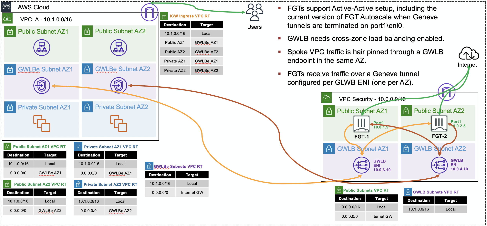

## Solution Components
GWLB is a load balancer that accepts all IP traffic and forwards this to targets in a target group.  GWLB supports being deployed into multiple availability zones.  GWLB itself receives traffic with the use of GWLB endpoints (GWLBe).  GWLBe are VPC endpoints that you deploy into your workload VPCs subnets.  Then you can use VPC routing to send traffic to the GWLBe in the same availability zone.

With the introduction of VPC Ingress Routing back in 2019, you can apply VPC route tables to an Internet Gateway (IGW) or Virtual Private Gateway (VGW).  This allows you to direct traffic destined to a local VPC subnet to a GWLBe in the same availability zone.  This means you can inspect inbound traffic before it is sent to a public load balancer or instance.

Once the GWLBe receives the traffic, it uses PrivateLink to privately route the traffic to a GWLB node in the same availability zone.  Since GWLB can be deployed across multiple availability zones, there is a GWLB node in each availability zone.  For more  details on this, reference [AWS Documentation](https://docs.aws.amazon.com/vpc/latest/privatelink/vpce-gateway-load-balancer.html).

Each GWLB node uses an IP listener to receive the traffic and then forward traffic to the target group specified in the listner rule.  GWLB nodes maintains stickiness of flows to a specific target group member using 5-tuple hash (for TCP/UDP flows) or 3-tuple hash (for non-TCP/UDP flows).  This allows traffic for a specific flow to symetrically be routed to the same FortiGate so layer 7 NGFW inspection, including SSL Man in the Middle (MitM), can be applied.

By default, each GWLB node deployed in an availability zone distributes traffic across the registered and healthy targets within the same availability only. If you enable cross-zone load balancing, each GWLB node distributes traffic across all registered and healthy targets in all enabled Availability Zones.

Once a GWLB node picks a target to send traffic to, it will encapsulate the dataplane traffic in a GENEVE tunnel and forwards this to the target.  When the FortiGate receives the GENEVE traffic, it will terminate the tunnel and inspect the original dataplane traffic using NGFW policies and features.  The GENEVE tunnel header uses TLVs that includess information such as the VPC endpoint id of the GWLBe that received the original traffic and the flow hash.  For more details on this, reference [AWS Documentation](https://aws.amazon.com/blogs/networking-and-content-delivery/integrate-your-custom-logic-or-appliance-with-aws-gateway-load-balancer/).

After NGFW inspection, the FortiGate can use simple policy and static routing to either route the traffic back to the same GWLB node using a GENEVE tunnel or send this out a local interface to access internet-based resources.  With simple policy and routing changes you can change how routing is handled to support different use cases.

After the GWLB node receives the traffic back from the FortiGate, it sends the traffic back to the same GWLBe that originally received the traffic.  Finally, the GWLBe in the workload VPC will send the traffic to the intrinsic router which uses the assigned VPC route table's routes to send the traffic to the destination.

## Use Cases

**There are two architectures shown below, however a single GWLB and fleet of FortiGates can cover both use cases at the same time.  The use cases are shown separately below to simplify the concepts.**

### North-South
**Reference Diagram:**

A common architecture pattern is to inspect both ingress and egress traffic for your workload VPCs.  Ingress is traffic initiated from internet-based sources being received by your public load balancers or directly to EIPs in your workload VPCs.  Egress is traffic initiated from your private resources in your workload VPCs that are going to public destinations.

**For ingress traffic inspection**, we will use VPC Ingress Routing to capture ingress traffic at the IGW after destination NAT was applied by the IGW.  If the destination is an EIP, the new destination IP will be the private IP that is associated to the public EIP.  If the destination is a public load balancer, the new destination IP will be the private IP of the public load balancer node ENI.  The IGW will then use the assigned VPC route table with more specific routes to send anything destined to the public or private subnets to the GWLBe in the same availability zone.

After traffic has been processed by the GWLB node in the same availability zone and FortiGate, the inspected traffic comes back out the same GWLBe.  Then the intrinsic router will use the assigned VPC route table to send traffic to the appropriate destination using the "local" VPC route.

**For reply ingress traffic**, If a public load balancer was used, reply traffic from the private resource will go back to the appropriate load balancer.  Then the intrinsic router will use the assigned VPC route table to capture egress traffic matching a default route and send it to the GWLBe in the same availability zone.

After traffic has been processed by the GWLB nodes and FortiGates, the inspected traffic comes back out the same GWLBe.  Then the intrinsic router will use the assigned VPC route table to send traffic to the internet using the default route pointing to the IGW.  Once the IGW receives the traffic, it will apply source NAT to the appropriate public IP for an EIP or public load balance node.

**For egress traffic inspection**, the private resource traffic will be sent to the intrinsic router which will use the assigned VPC route table to capture egress traffic matching a default route and send it to the GWLBe in the same availability zone.

After traffic has been sent to the GWLB node in the same availability zone, the FortiGate will inspect the traffic and source NAT the traffic and send this out port1 to the intrinsic router.  The intrinsic router will use the assigned VPC route table to match the default route going to the security VPC IGW. The IGW will then source NAT the traffic to the EIP associated to the port1 private IP of the FortiGate.

**For reply egress traffic**, this will come back to the same FortiGate with the same EIP, and traffic will be sent back through the same GWLB node, then back to the same GWLBe in the same availability zone.  Then the intrinsic router will use the assigned VPC route table to then send traffic to the appropriate destination using the "local" VPC route.

### East-West
**Reference Diagram:**
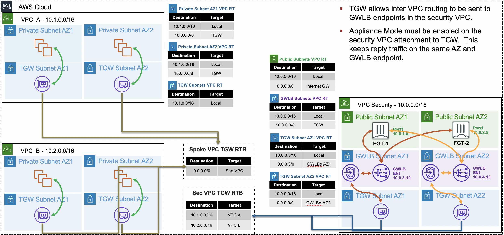

Another common architecture pattern is to inspect traffic between your workload VPCs.  East-west traffic can be traffic between your workload VPCs and even between anything privately reachable via Transit Gateway (TGW).

**For east-west traffic inspection**, we will use VPC routing to send traffic to the local TGW attachment in the same availability zone in the workload VPC.  Traffic will be received at the Spoke VPC TGW route table which will send the traffic to the security VPC TGW attachment where the GWLB and FortiGates stack is located.

Once traffic is received at the TGW attachment in the same availability zone in the security VPC, the intrinsic router will use the assigned VPC route table to send traffic to the GWLBe in the same availability zone.

After traffic has been processed by the GWLB node in the same availability zone and FortiGate, the inspected traffic comes back out the same GWLBe.  Then the intrinsic router will use the assigned VPC route table to send traffic back to the same TGW attachment.

Traffic will be received at the Security VPC TGW route table which will send traffic to the appropriate workload VPC TGW attachment.  Once traffic is received at the same TGW attachment in the workload VPC, the intrinsic router will use the assigned VPC route table to then send traffic to the appropriate destination using the "local" VPC route

**For reply east-west traffic inspection**, the same process will be followed to send reply traffic back through TGW, GWLBe, GWLB node, and Fortigate.  However, there is an important point to note.

**If the resources are in different availabilities, by default TGW will not keep reply traffic in the original availability zone.**  This means the reply traffic would be sent to the wrong GWLBe and GWLB node which do not know about this existing flow and would be dropped.

To change this behavior to have TGW keep the reply traffic on the original availability zone, we need to enable TGW appliance mode.  **Thus we recommend that TGW appliance mode should be enabled to keep traffic flows symetrical.**  For more details on this, reference [AWS Documentation](https://docs.aws.amazon.com/vpc/latest/tgw/transit-gateway-appliance-scenario.html).

## Failover Process
AWS Elastic Load Balancinig services all have a form of health checking targets in a target group to provide resiliency.  **With GWLB an important point to note is how target failure behavior is handled when all targets in a single availability zone have failed.**

By default, cross zone load balancing is disabled on GWLB.  This means that if all targets in a single availability have failed (ie AZ1), the GWLB node in that same availability zone will not send traffic to healthy targets in different availability zone (ie AZ2).  Instead the GWLB node will fail open and continue to send any traffic it receives to the same unhealthy targets in the same availability zones.

**Cross Zone Load Balancing Disabled:**
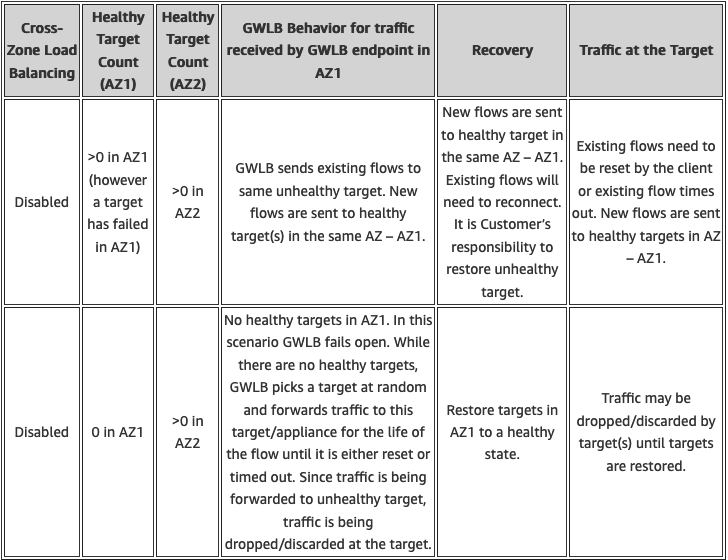

To change this behavior, you can simply enable cross zone load balancing.  This changes the behavior so that if all targets in a single availability have failed (ie AZ1), the GWLB node in that same availability zone will send traffic to healthy targets in different availability zones (ie AZ2, AZ3).  In fact, with cross zone load balancing enabled, the GWLB nodes will be evenly distributing traffic to healthy FortiGates in all zones.

**Cross Zone Load Balancing Enabled:**

**Thus we recommend that cross zone load balancing should be enabled for the best resiliency for your environment.**  For more details on this, reference [AWS Documentation](https://aws.amazon.com/blogs/networking-and-content-delivery/scaling-network-traffic-inspection-using-aws-gateway-load-balancer/.

## CloudFormation Templates
CloudFormation templates are available to simplify the deployment process.

The FGCP templates are organized into different folders based on the FortiOS version.  Once a FortiOS version is selected, templates are available to build a new base VPC if needed and an existing FGT template to deploy the clustered instances.

Here is a list of the templates currently available in this repo:
  - [SecurityVPC_FGT_GWLB_DualAZ](./SecurityVPC_FGT_GWLB_DualAZ.template.json)
  - [SpokeVPC_GWLBe_DualAZ](./SpokeVPC_GWLBe_DualAZ.template.json)

The Security VPC template deploys AWS infrastructure and also bootstraps the FortiGate instances.  Most of this information is gathered as variables in the templates when a stack is deployed.  These variables are organized into these main groups:
-	VPC Configuration
-   TGW Configuration
-	FortiGate Instance Configuration

The Spoke VPC template deploys AWS infrastructure only to support workloads.  This template is organized into similar groups:
-	VPC Configuration
-   GWLBe Configuration
-   TGW Configuration

### VPC Configuration
In this section the parameters will request general information for creating the VPCs.  Below is an example of the parameters template parameters.

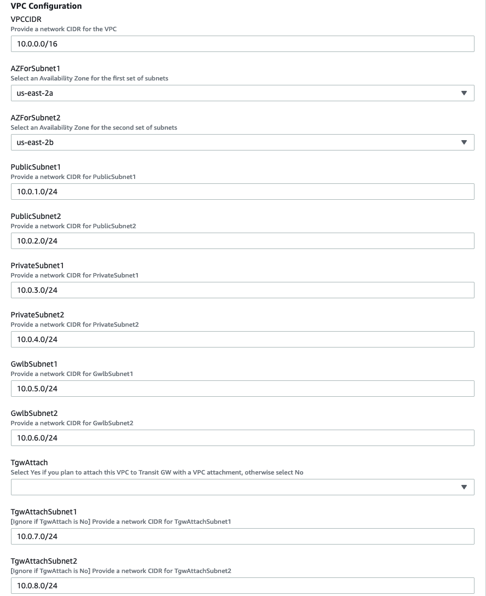

### TGW Configuration
The Security VPC template allows you to create or use an existing  TGW.  Also, if TGW will not be used in the deployment you can specify 'No' for 'TgwCreation' and ignore the 'TgwExisting' parameters. 

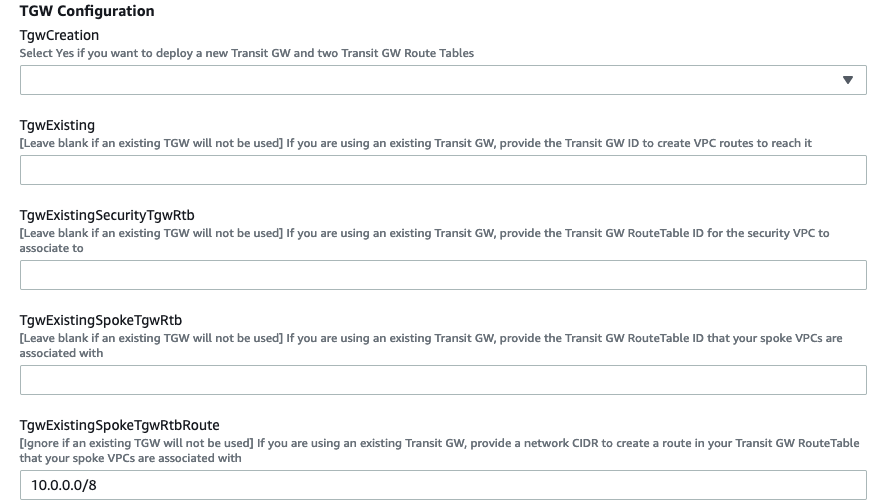

### FortiGate Instance Configuration
For this section the parameters will request general instance information such as instance type and key pair to use for deploying the instances.  Also, FortiOS specific information will be requested such as the init S3 bucket, FortiOS version, LicenseType, and FortiGate License filenames.

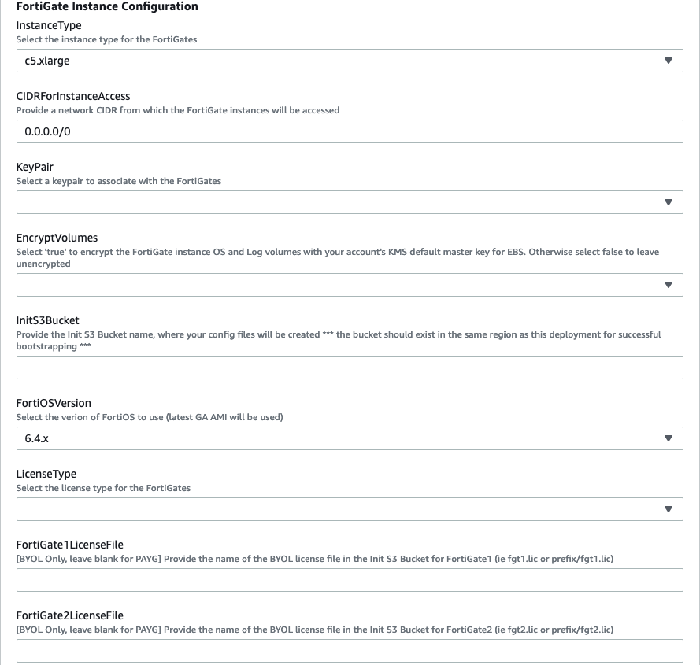

## Deployment
Before attempting to create a stack with the templates, a few prerequisites should be checked to ensure a successful deployment:
1.	An AMI subscription must be active for the FortiGate license type being used in the template.
  * [BYOL Marketplace Listing](https://aws.amazon.com/marketplace/pp/B00ISG1GUG)
  * [PAYG Marketplace Listing](https://aws.amazon.com/marketplace/pp/B00PCZSWDA)
2.	The solution requires 2 EIPs to be created so ensure the AWS region being used has available capacity.  Reference [AWS Documentation](https://docs.aws.amazon.com/AWSEC2/latest/UserGuide/ec2-resource-limits.html) for more information on EC2 resource limits and how to request increases.
3.	If BYOL licensing is to be used, ensure these licenses have been registered on the support site.  Reference the VM license registration process PDF in this [KB Article](http://kb.fortinet.com/kb/microsites/search.do?cmd=displayKC&docType=kc&externalId=FD32312).
4.   **Create a new S3 bucket in the same region where the template will be deployed.  If the bucket is in a different region than the template deployment, bootstrapping will fail and the FGTs will be inaccessible**.
5.  If BYOL licensing is to be used, upload these licenses to the root directory of the same S3 bucket from the step above.
6.  **Ensure that all of the PublicSubnet's AWS route tables have a default route to an AWS Internet Gateway.**  Reference [AWS Documentation](https://docs.aws.amazon.com/vpc/latest/userguide/VPC_Route_Tables.html#route-tables-internet-gateway) for further information.

Once the prerequisites have been satisfied, login to your account in the AWS console and proceed with the deployment steps below.

----
1.  In the AWS services page under All Services > Management Tools, select CloudFormation.

2.  Select Create Stack then select with new resources.

3.  On the Select Template page, under the Choose a Template section select Upload a template to Amazon S3 and browse to your local copy of the chosen deployment template.

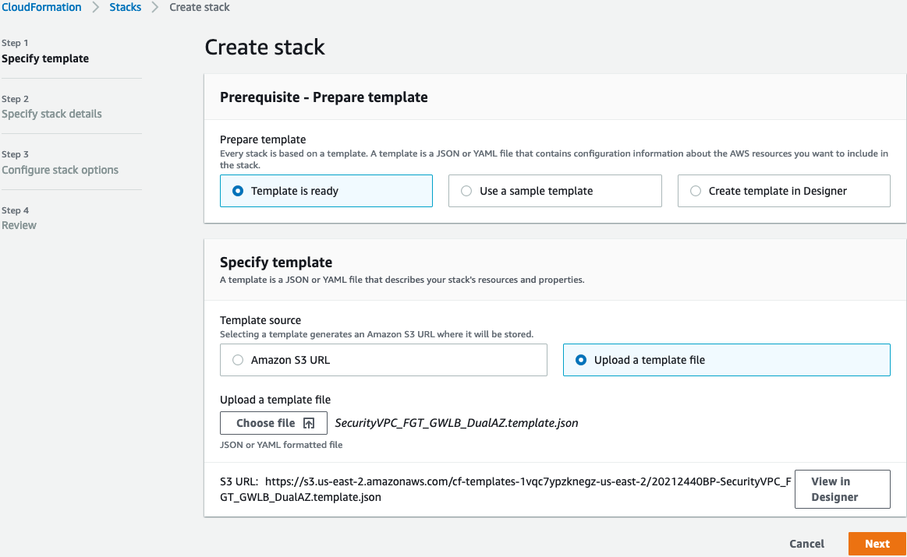

4.  On the Specify Details page, you will be prompted for a stack name and parameters for the deployment.  Since we plan to use TGW for east-west inspection of traffic between workload VPCs, we set 'TgwAttach' and 'TgwCreation' to yes.

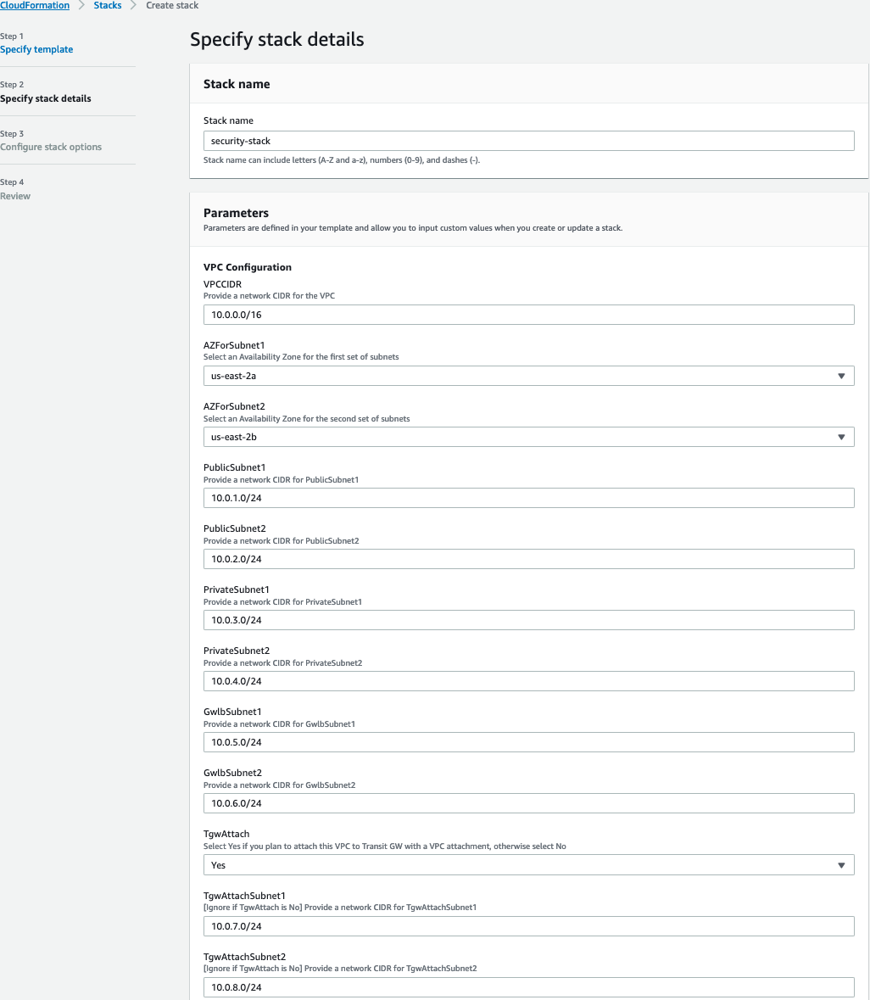
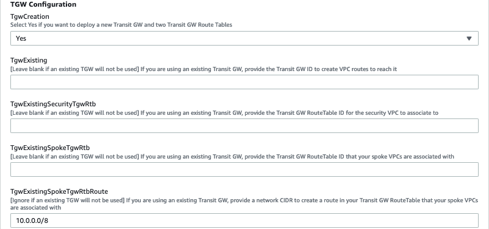

5.  In the FortiGate Instance Configuration parameters section, we have selected an Instance Type and Key Pair to use for the FortiGates as well as BYOL licensing.  Notice we are prompted for if an S3 endpoint should be deployed, the InitS3Bucket, FortiOSVersion, License Types, FortiGate1LicenseFile, and FortiGate2LicenseFile parameters.  For the values we are going to reference the S3 bucket and relevant information from the deployment prerequisite step 4.  Then select Next.

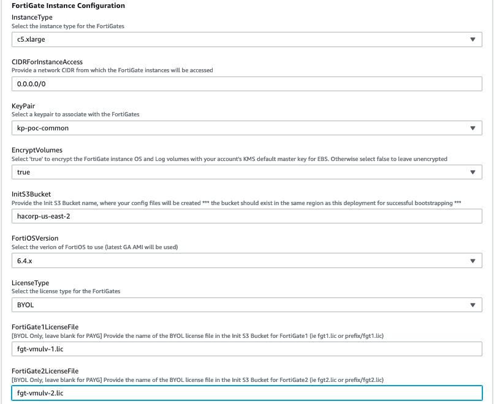

6.  On the Options page, you can scroll to the bottom and select Next.  On the Review page, scroll down to the capabilities section.  As the template will create IAM resources, you need to acknowledge this by checking the box next to ‘I acknowledge that AWS CloudFormation might create IAM resources’ and then click Create.

7.  On the main AWS CloudFormation console, you will now see your stack being created.  You can monitor the progress by selecting your stack and then select the Events tab.

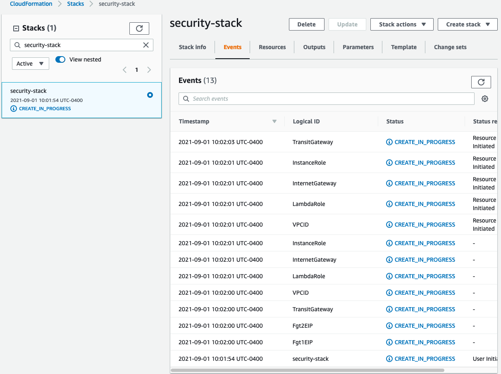

8.  Once the stack creation has completed successfully, select the Outputs tab to get the information needed to deploy two workload VPCs.  These will be used as parameter inputs for the spoke VPC template.  Here are the parameters used for the two spoke VPC deployments.

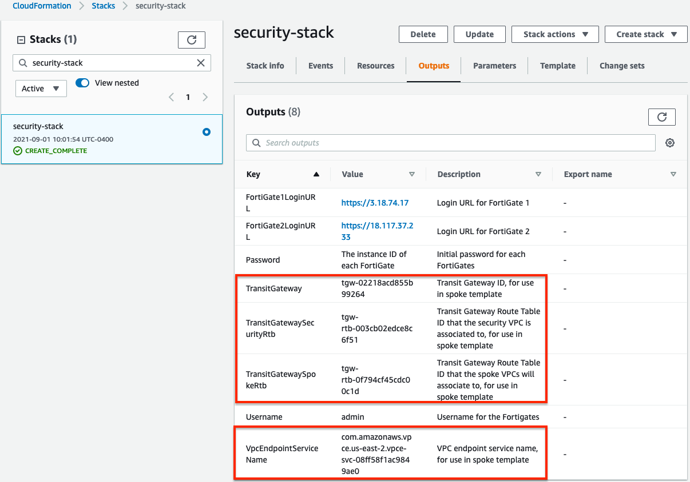
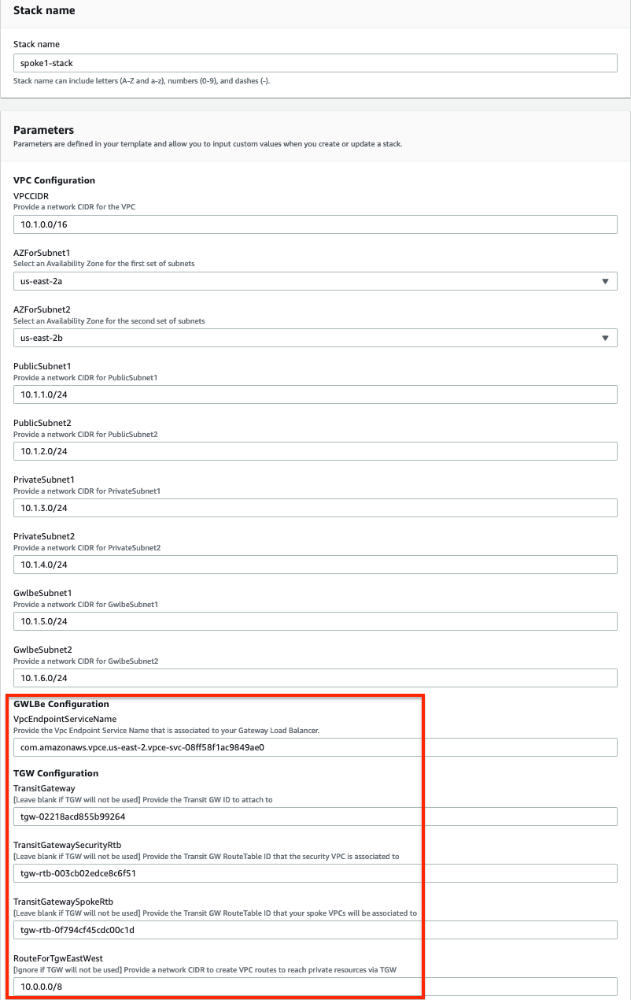
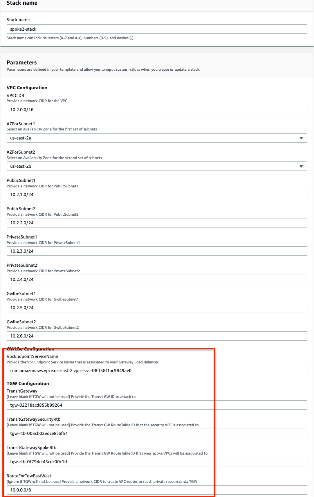

9.  We deployed some workload instances in both spoke VPCs to generate traffic flow through the security stack.

10.  Once the security stack creation has completed successfully, select the Outputs tab to get the login information for the FortiGate instances.

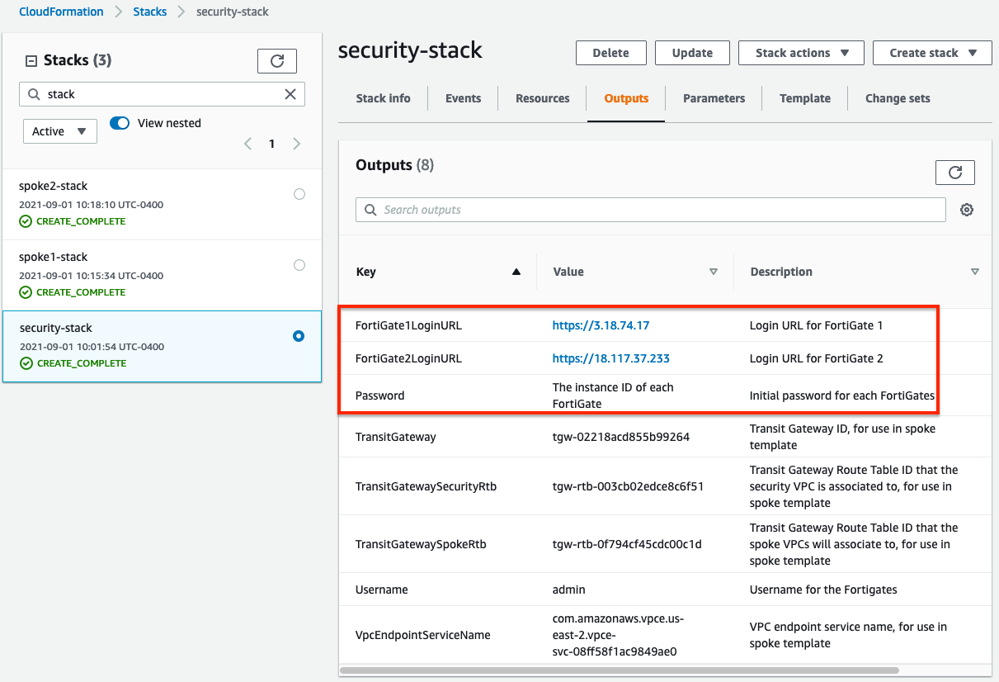

11.  On FortiGate1 navigate to Network > Interfaces, Network > Policy Routes, Network, and run the CLI command 'get router info routing-table all' to see the bootstrapped networking config.  

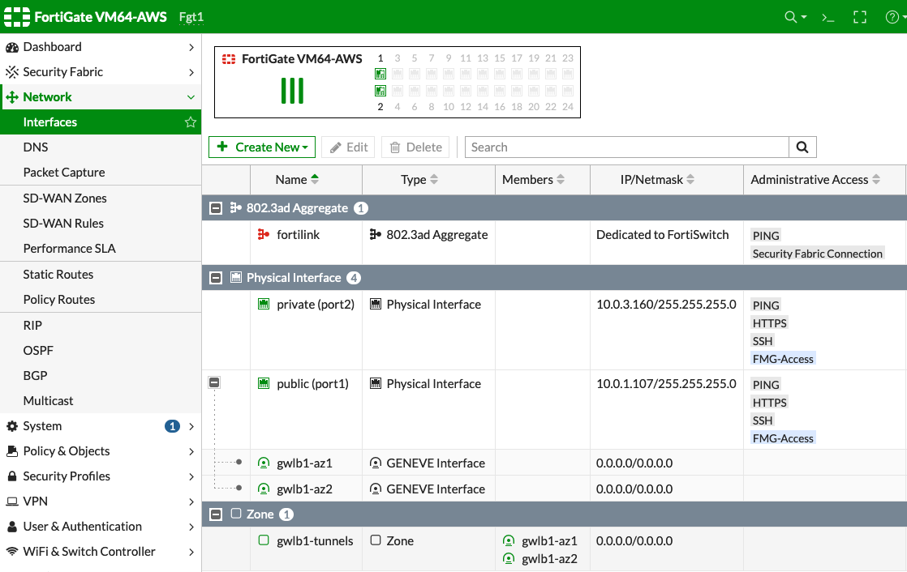
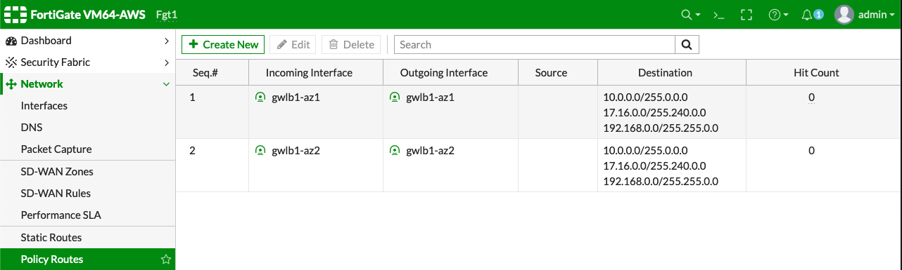
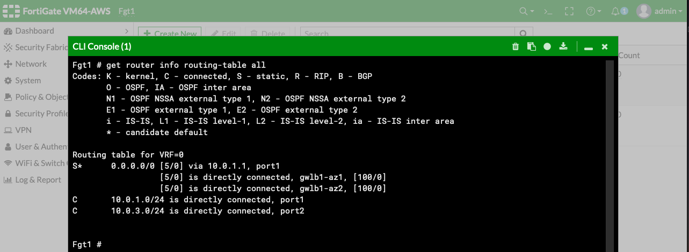

12.  After accessing one of the jump box instances, we can use a sniffer command on either or both FortiGates to see traffic flow over the GENEVE tunnels to different destinations.

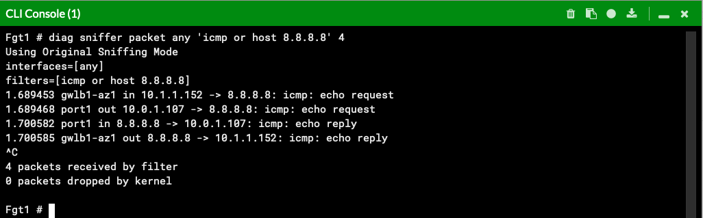

13.  This concludes the template deployment example.
----

## FAQ \ Troubleshoot
  - **Can you terminate the GENEVE tunnels on a different ENI like ENI1\port2? **

Yes.  This can be done but would require you to use an IP based target group instead of an Instance based target group.  This would not work for the official FortiGate Auto Scale solution so this would be limited to a manual scale deployment.

